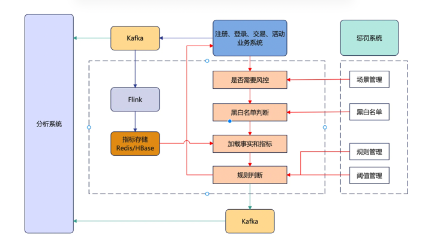

# flink to clickhouse 
1、风控系统两种技术路线
1.1 规则：简单直观、可解释性强、灵活
规则就是针对事务的条件判断，我们对登录、注册、交易、活动设定几种情况：
● 用户名与身份证名不一致
● 某IP最近一小时注册账号数超过10个
● 某账号最近3分钟登录次数大于5
● 某账号群体最近1小时购买优惠商品超过100件
规则可以组合成规则组：
● 事实：判断的主体和属性，如上账号的登录次数、注册次数等
● 条件：判断的逻辑，某事实的属性大于某指标
● 指标阈值：判断依据，比如登录次数临界阈值
● 规则由运营专家凭经验填写，规则需要支持动态调整

1.2 模型：规则容易被黑客刻意规避，模型训练+机器学习（特征工程）

2、风控系统架构

该系统由3条数据流向
● 实时风控数据流: 由红线标识，同步调用，为风控调用的核心链路
● 准实时指标数据流: 由蓝线标识，异步写入，为实时风控部分准备指标数据
● 准实时/离线分析数据流: 由绿线标识，异步写入，为风控系统的表现分析提供数据
2.1 实时风控
● 实时风控是整个系统的核心，被业务系统同步调用，完成对象的风控判断
● 规则往往由人编写并且需要动态调整，所以会把风控判断部分与规则管理部分拆开。规则管理后台为运营服务，由运营人员去进行相应操作。
● 场景管理：决定某个场景是否实施风控，比如 活动场景，在活动结束后可以关闭该场景
● 黑白名单: 人工/程序找到系统的黑白名单，直接过滤
● 规则管理: 管理规则，包括增删改，比如：登录新增IP地址判断、下单新增频率校验
● 阈值管理: 管理指标的阈值，比如规则为：某IP最新1小时注册账号数不能超过10个，那么1和10都属于阈值
● 基于管理后台那么规则判断部分的逻辑就十分清晰了，分别包括前置过滤、事实数据准备、规则判断三个环节
前置过滤
● 业务系统在特定事件（如 登录、注册、下单、参加活动）被触发后同步调用风控系统，附带相关上下文，比如 IP地址、时间标识等，规则判断部分会根据管理后台的配置决定是否逆行判断，如果是，接着进行黑白名单过滤，都通过后进入下一个环节
实时数据准备
在进行判断之前，系统必须准备一些事实数据，比如：
● 注册场景： 假如规则为单一IP最近1小时注册账号不超过10个，那么需要根据IP地址去Redis/HBase找到该IP最近1小时注册账号的数目，比如15
● 登录场景: 假如规则为单一账号最近3分钟登录次数不超过5次，那么需要根据IP地址去Redis/HBase找到该账号最近3分钟登录的次数，比如8
规则判断
● 在得到事实数据之后，系统会根据规则和阈值进行判断，然后返回结果，整个过程便结束了
● 整个过程逻辑上是清晰的，我们常说的规则引擎在这部分起作用，一般来说这个过程由两部分实现方式：
> 借助成熟的规则引擎（比如：Drools）， Drools与java环境结合非常好，本身也非常完善，支持很多。特性
> 基于Groovy等动态语言实现
准实时数据流
● 这部分属于后台逻辑，为风控系统服务，准备事实数据
● 把数据准备与逻辑判断拆分，是出于系统的性能/可扩展性角度考虑的。前面提到，做规则判断需要事实的相关指标，比如最近1小时登录次数，最近1小时注册账号数。这些指标通常有一段时间跨度，是某种状态或聚合，很难在实时风控过程中根据原有数据进行计算，因为风控的规则引擎往往是无状态的，不会记录前面的计算结果
● 同时，这部分原始数据量很大，因为用户活动的原始数据都需要传过来进行计算，所以这部分往往由一个流式大数据系统来完成
● 业务系统部埋点数据发送到kafka，flink订阅kafka，完成原子粒度的聚合
● flink仅完成原子粒度的聚合是和规则的动态变更逻辑相关的，举例来说，在注册场景中，运营同学会根据效果一会要判断某IP最近1小时的注册账号数，一会要判断最近3小时的注册账号数，一会又要判断最近5小时的注册账号数...， 也就是说这个最近N小时的N是动态调整的。那flink在计算时只应该计算1小时的账号数，在判断过程中根据规则来读取最近N小时，然后进行聚合再判断。因为在flink运行机制中，作业提交后会持续运行，如果调整逻辑需要停止作业，修改代码并重启。同时因为flink中间状态的问题，重启还面临中间状态能否复用，所以如果由flink直接计算最近N小时的聚合会非常麻烦
> Flink把汇总的指标写入Redis/HBase，供实时风控系统查询
> 通过把数据计算和逻辑判断拆分开并引入Flink，我们的风控系统可以应对极大的用户规模
分析系统
● 前面的内容静态来看是一个完整的风控系统，但动态来看就有些缺失，这种缺失不体现在功能性上，而是体现在演进上，即如果从动态的角度看一个风控系统的话，我们至少还需要两部分，一是衡量系统的整体效果，二是为系统提供 规则/逻辑 升级的依据
● 在衡量整体效果方面，我们需要：
> 判断规则是否失效，比如拦截率的突然降低
> 判断规则是否多余，比如某规则从来没有拦截过任何事件
> 判断规则是否有漏洞，比如在举办某个促销活动或发放代金券后，福利被领完了但没有达到预期效果
● 在为系统提供 规则/逻辑升级方面，我们需要：
> 发现全局规则: 比如某人在电子产品的花费突然增长了100倍，单独来看是有问题的，但整体来看可能很多人都出现了这个现象，原来是苹果发布了新品
> 识别某种行为的组合: 单次行为是正常的，但组合是异常的，比如用户买菜刀是正常的，买车票是正常的，但短期内同时做做就可能是异常的。
> 群体识别：比如通过图分析技术，发现某个群体，然后给这个群里的所有账号都打上群体标签，防止出现每个账号都表现正常，但整个群体都在集中薅羊毛的情况
这便是分析系统的角色定位，在他的工作中有部分是确定的，也有部分是探索性的，为了完成这种工作，该系统需要尽可能多的数据支持
● 业务系统的数据、业务的埋点数据，记录详细的用户、交易或活动数据
● 风控拦截数据，风控系统的埋点数据，比如某个用户在具有某些特征的状态下因为某条规则而被拦截，这条拦截本身就是一个事件数据

